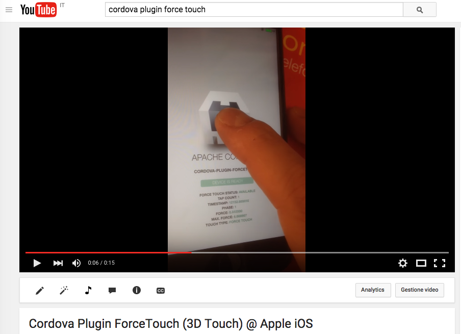

# Cordova iOS Force Touch Plugin
### (cordova-plugin-forcetouch v1.1.6)

## Author
```
Matteo Pisani
E-mail: matteo.pisani.91@gmail.com
Linkedin: http://www.linkedin.com/in/matteopisani
```

## Description
This plugin allows developer to manage Force Touch readable variables of supported Apple devices.
It returns Force Touch data, prefixed with "ForceTouch" object.

## Supported Devices (Apple)
- iPhone 6S
- iPhone 6S Plus
- iPad Pro

## Supported OS
- iOS => 9.0

## Starting
Create a new Cordova Project

    $ cordova create ForceTouchApplication com.development.forcetouch ForceTouchApplication

## Installing the plugin (from GIT)
Clone the plugin

    $ git clone https://github.com/xonoxitron/cordova-plugin-forcetouch.git

Install the plugin

    $ cd ForceTouchApplication
    $ cordova -d plugin add ../cordova-plugin-forcetouch

Or alternatively

## Installing the plugin (from NPM)
Clone the plugin

    $ cd ForceTouchApplication
    $ git clone cordova-plugin-forcetouch

## Using

Edit `~/ForceTouchApplication/www/yourfile.js` and add the following code inside an `onDeviceReady` event

```js
document.addEventListener('deviceready', function ()
{
  // on touch start cordova core asks to iOS for ForceTouchData
  document.body.addEventListener('touchstart', function(e)
  {
    e.preventDefault();
    // call the plugin for getting ForceTouch Data object
    ForceTouch.getForceTouchData(function (ForceTouchData)
    {
      var forceTouchCapability = '';
      switch(ForceTouchData.forceTouchCapability)
      {
        case '0':
          forceTouchCapability += 'Unknown';
        break;
        case '1':
          forceTouchCapability += 'Unavailable';
        break;
        case '2':
          forceTouchCapability += 'Available';
        break;
      }
      // setting output values
      document.getElementById('forceTouchCapability').innerHTML = forceTouchCapability;
      document.getElementById('tapCount').innerHTML = ForceTouchData.tapCount;
      document.getElementById('timestamp').innerHTML = ForceTouchData.timestamp;
      document.getElementById('phase').innerHTML = ForceTouchData.phase;
      document.getElementById('force').innerHTML = ForceTouchData.force;
      document.getElementById('maximumPossibleForce').innerHTML = ForceTouchData.maximumPossibleForce;
      // check if ForceTouch or StandardTouch
      if(parseFloat(ForceTouchData.force) > 0.0)
        document.getElementById('touchType').innerHTML = 'Force Touch';
      else
        document.getElementById('touchType').innerHTML = 'Standard Touch';
    });
  }, false);

  // on touch end values are set to original state
  document.body.addEventListener('touchend', function(e)
  {
    e.preventDefault();
    // restore output values
    document.getElementById('forceTouchCapability').innerHTML = '-';
    document.getElementById('tapCount').innerHTML = '-';
    document.getElementById('timestamp').innerHTML = '-';
    document.getElementById('phase').innerHTML = '-';
    document.getElementById('force').innerHTML = '-';
    document.getElementById('maximumPossibleForce').innerHTML = '-';
  }, false);
}, false);
```
## Testing
Install iOS platform

    cordova platform add ios

Run the code

    cordova run ios

Or

    cordova run ios --device

## Demo Video

[](https://www.youtube.com/watch?v=bDQ5jGhM0ZY)

## Test Application
- Inside the path `~/cordova-plugin-forcetouch/test/ForceTouchApplication` there's the `XCode iOS` test application,
just open it, build it, connect your device and deploy it in.
- When test application opens, it will start immediatly to acquire `ForceTouchData (object)`.
- Cordova core brings to JavaScript the object in question by calling through API `Force Touch Properties` of UITouch Class.
- By pressing the touchscreen, if your device is supported, you should read each of the `ForceTouchData Properties` listed below the "DEVICE IS READY".

- Phone 5,1 (No ForceTouch)

&nbsp;

- iPhone 8,1 (ForceTouch Supported)

&nbsp;

## ForceTouchData `(object)`
```json
{
  "forceTouchCapability" : "0",
  "tapCount" : "0",
  "timestamp" : "0.000000",
  "phase" : "0",                  
  "force" : "0.000000",
  "maximumPossibleForce" : "0.0"
}

Types

forceTouchCapability     (int enum) 0:UNKNOWN | 1:UNAVAILABLE | 2:AVAILABLE
tapCount                 (int)
timestamp                (float)
phase                    (int)
force                    (float) min value: 0.0 max value: 1.0
maximumPossibleForce     (float)

```

## Apple Official Force Touch Documentation for iOS
```
https://developer.apple.com/library/ios/documentation/UIKit/Reference/UITouch_Class/index.html
```
